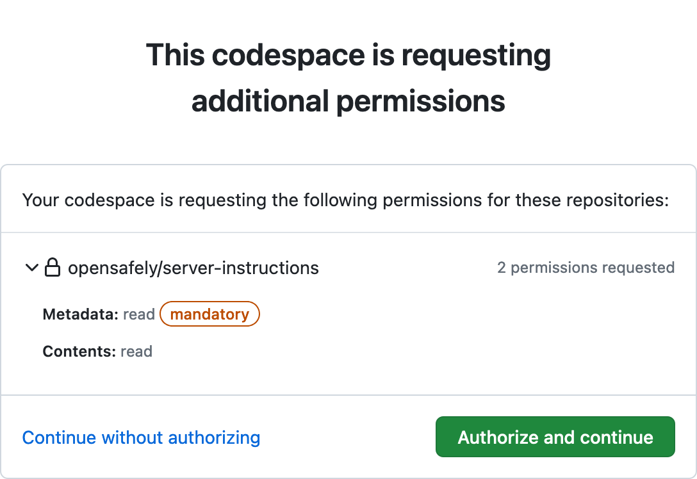
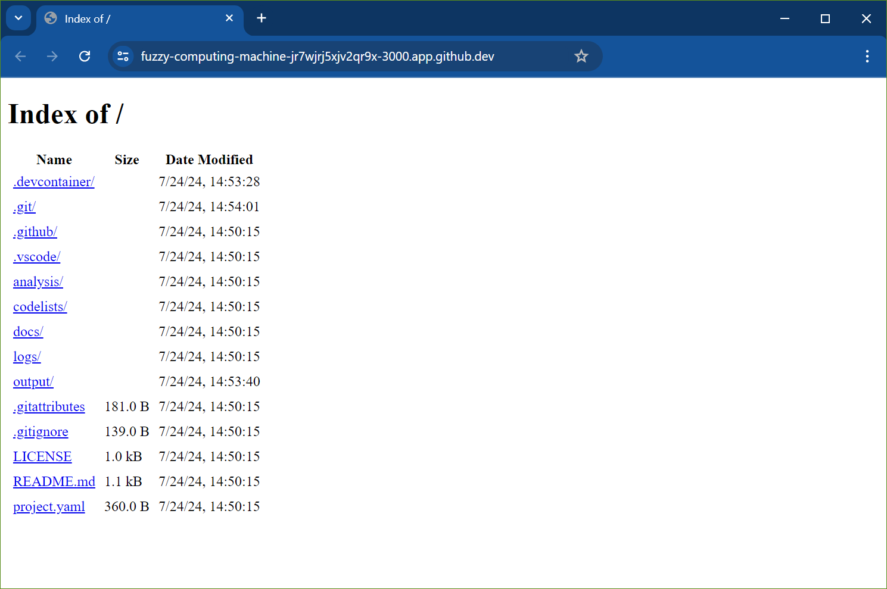

This page describes how to troubleshoot common Codespaces-related issues.

## "This codespace is requesting additional permissions"

On opening a Codespace you will see the following message:

This is perfectly normal and is a result of how we have configured Codespaces to work with Stata.

If you plan to use Stata in your project, then you will need to click the "Authorize and continue" button.
If you do not plan to use Stata, then you may click either button.

## My Codespace says it's in "recovery mode"

Occasionally when creating a Codespace something goes wrong. In these instances, GitHub will boot the Codespace into a "recovery mode". This provides you with a very basic environment in which to debug the problem. If this happens, either delete it and try again or contact tech support. If you contact tech support, then don't delete the Codespace, as it's likely you'll be asked for the creation logs so the problem can be investigated.

In recovery mode, you will not be able to access any of the usual tools or VS Code plugins. Some basic functionality, like copy and paste, may not work as expected either. So you should not attempt you use it for any work. GitHub provide some more information about Codespace recovery mode in their [documentation](https://docs.github.com/en/codespaces/troubleshooting/troubleshooting-creation-and-deletion-of-codespaces#codespace-creation-fails).

## R Session Error

After restarting a stopped Codespace in which you were using RStudio, you may see the following error:

We have not observed any instances of work being lost in conjunction with this error, and so in most cases it can safely be ignored.
Manually terminating your R session before stopping the codespace may prevent this error from appearing.

## Git functionality is missing from RStudio

When you open RStudio within a Codespace, you may find that the Git Menu and Git Tab are missing from the user interface.
This is because, as stated in the [RStudio version control documentation](https://docs.posit.co/ide/user/ide/guide/tools/version-control.html):

> RStudio’s version control features are tied to the use of [Projects](https://docs.posit.co/ide/user/ide/guide/code/projects.html)

Therefore, if you have not already created an RStudio project file (.Rproj) file in your repository you can do so by using the New Project Wizard in RStudio to "associate a project with an existing directory". Once your repository is opened in project mode the Git features will be enabled.

## RStudio's Files tab is not showing the correct directory

Sometimes, when opening RStudio, you may find that the [Files tab](https://docs.posit.co/ide/user/ide/guide/ui/files.html) is not displaying your project directory.

Opening the "More" menu in this tab and selecting "Go To Working Directory" should take you to your project directory.

If this does not work, you will need to navigate to your project directory in the Files tab (`/workspaces/{the name of your github repository}`).
Once you have done this, you may need to select "Set As Working Directory" from the "More" menu of the Files tab to ensure this directory is correctly opened the next time you open RStudio.

## My favourite VS Code extensions are not installed/I'd like to change the settings

You are free to install any VS Code extensions and change any settings you wish within your Codespaces.
However, you will find that any changes you make will not be preserved when you start a new Codespace.

If you wish to make changes that will apply whenever anyone opens your project, then consider using a [Workspace Settings](https://code.visualstudio.com/docs/configure/settings#_workspace-settings) file in your project.

If you wish your settings and extensions to be available anywhere you open VS Code (including in Codespaces), then consider using [Settings Sync](https://code.visualstudio.com/docs/editor/settings-sync).

## Previewing HTML files doesn't work

If you are using a codespace to author an HTML file, for example a report, you may wish to see a preview of this. Microsoft's [Live Preview](https://marketplace.visualstudio.com/items?itemName=ms-vscode.live-server) VS Code extension is frequently used for this purpose.
However, if you try to use this extension in a codespace, you might see error messages such as: "This content is blocked. Contact the site owner to fix the issue…" or see that the preview window appears blank.
This is a [currently known issue](https://github.com/microsoft/vscode-livepreview/issues/111) with the extension.

### Workaround

When you first try to open a preview window via the context menu (right click), you may see a pop-up in the bottom right hand corner of your screeen advising you of a new "application running on port 3000":

Clicking "Open in Browser" should open a new tab where you will see a directory listing of the files in your workspace, and from which you can navigate to your desired html file:

You can also navigate to this window via the "Ports" tab in VS Code:

### Alternative extension

There is also an [alternative preview extension](https://marketplace.visualstudio.com/items?itemName=searKing.preview-vscode), which [reportedly](https://stackoverflow.com/questions/74452866/how-preview-a-html-file-github-codespaces/75135098#75135098) is not affected by this issue.
We have not tested this extension and therefore cannot vouch for its functionality or safety.

## My code runs fine in the codespace's local environment but not as an OpenSAFELY action (or vice versa)

Your codespace comes pre-installed with all the packages from the [`r:v1`](../../../actions-scripts.md#r) and [`python:v2`](../../../actions-scripts.md#python) action images.

These action images are the environment in which your code is executed via the [`opensafely`](../../../opensafely-cli.md) command.

For actions that use these image versions in their `run: ` stanza in project.yaml, we expect the behaviour of your R or python scripts to be the same when executed via `opensafely run` or directly in codespace environment (or in the provided RStudio environment for R).

If you have actions defined in your [project pipeline file](../../../actions-pipelines.md#projectyaml-format) that reference older images like `python:v1` or `jupyter:v1` (or — due to an _unfortunate_ historical naming convention —  `python:latest` or `jupyter:latest`),
or the newer `r:v2` image, then the behaviour of your code when run in those images may not be the same as if you run the code directly in the codespace. This is because the installed packages and versions of Python or R that are available differ between these environments.

If this is the case for your project, your options are:

For older images like `python:v1` or `jupyter:v1`:

* Update your project pipeline file to reference the most recent action images and make any neccesary changes to your code (recommended)
* Retain the references to the older action images, and use [`opensafely exec`](../../../opensafely-cli.md#exec-interactive-development) for interactive development using these action images' environments

For the recently released `r:v2` image, until we have support for its version of R and libraries natively in codespaces, you can:

* Follow the instructions for [manually running `r:v2` instance of Rstudio in codespaces](../use-github-codespaces-in-your-project/index.md#rstudio-with-the-rv2-image) (recommended)
* Use the older `r:v1` image in your actions, and the integrated codespaces RStudio.
