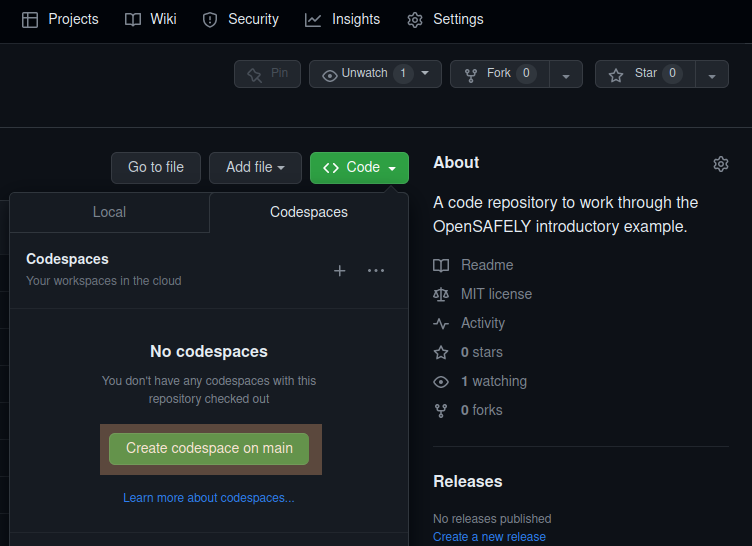
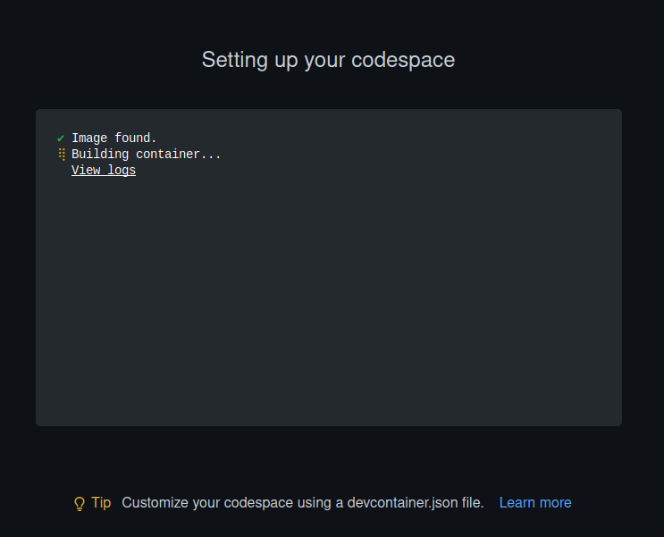

## Introduction

The OpenSAFELY research template contains a GitHub Codespaces configuration
to allow you to run OpenSAFELY
**without any installation required on your own computer**.

This page explains how to work with OpenSAFELY projects using GitHub Codespaces.

## Using GitHub Codespaces for OpenSAFELY projects

To start a Codespace,
you first need to [create a code repository](../../how-to/create-a-code-repository-for-your-project/index.md).
From that repository,
you can create a codespace.

### Create a codespace

Once you have a research code repository created,
you can create a codespace from that repository:

1. In a web browser,
   go to your newly created research code repository on GitHub.
1. Click the "Code" button
1. Select "Create codespace on main".
   The screenshot below shows this.



When you create a codespace,
GitHub has to set up the codespace.
The screenshot below shows this.



It may take a few minutes before the codespace is ready for use.

!!! info
    "main" is the current Git branch
    and what we will use for just trying everything out here.

    If you are working on another repository branch,
    it is possible to select "New from options",
    which allows you to choose the branch.
    The screenshot below shows this.

    

### Navigating the codespace

When the build process for the codespace completes,
you should see a Visual Studio Code editor with three panes.

Briefly, when you first open Visual Studio Code, you will see:

* at the far left, a vertical bar of icons showing various options
* on the left, the project's files and folders in the file explorer
* a terminal at the bottom-right
* a file editor at the upper-right;
  this initially remains blank until you open a file

The screenshot below shows this.


!!! info
    There are other elements to the user interface.
    If you are unfamiliar with Visual Studio Code, you can:

    * refer to the [explanation in GitHub's documentation](https://docs.github.com/en/codespaces/developing-in-codespaces/developing-in-a-codespace#working-in-a-codespace-in-the-browser)
      for more details.
    * refer to the [Visual Studio Code user interface documentation](https://code.visualstudio.com/docs/getstarted/userinterface)

It is possible to resize the different panes as needed
by hovering on the dividers between sections of the screen.

### Working with files

#### Editing code

The file explorer shows the contents of your code repository.

You can open files and folders by clicking on them.

#### Saving files in the codespace

The codespace is currently configured to autosave files when modified.

#### Reverting changes to files in the codespace

You can do this via the Source Control panel in the Visual Studio Code interface.

1. Select the Source Control panel on the left-hand side.
2. You should see a list of the changes.
3. You choose to "Discard Changes" for each file.
   This reverts the files back to how they are in the current version of the repository.
   The screenshot below shows this.


!!! info

    For users comfortable with command-line Git,
    you can use `git` in the terminal to work with the repository,
    including reverting changes.

    This page will not cover use of command-line Git.

#### Updating files in the repository

You can use the Source Control panel to update files in the repository.

A codespace is self-contained with its own copy of your repository's files.
This is just as if you were working on a local copy of the repository on your own computer.

**Changes to the copy of your repository in the codespace do not automatically change the state of your published repository on GitHub.**

To get changes from a codespace to the GitHub repository, you must use the Source Control view to add, commit and publish those changes
to your GitHub repository.
If you are unfamiliar with Visual Studio Code and GitHub,
[GitHub has a guide on using this](https://docs.github.com/en/codespaces/developing-in-codespaces/using-source-control-in-your-codespace#committing-your-changes).

When you update files by publishing to the repository's `main` branch,
this should trigger an automated check of whether your code will run in OpenSAFELY.
These checks can be viewed from the Actions tab,
accessed via your repository on GitHub's site.
The screenshot below shows what this tab looks like..


!!! info
    If you are comfortable with Git,
    you can also [create and switch between different branches in the codespace](https://docs.github.com/en/codespaces/developing-in-codespaces/using-source-control-in-your-codespace)
    in the Visual Studio Code interface
    or by the terminal using command-line Git.

## A quick overview of what is included in the codespace

Now that we have a GitHub codespace running,
we can use OpenSAFELY.

Here is a short, non-exhaustive guide to what OpenSAFELY provides in the codespace.

### Run the OpenSAFELY command-line interface (CLI)

* You can run the OpenSAFELY CLI in GitHub Codespaces.
  In the Visual Studio Code terminal, type `opensafely` and press ++enter++.
* You should see the OpenSAFELY CLI help prompt.
  The screenshot below shows this.


!!! info

    See the [OpenSAFELY CLI](../../../opensafely-cli.md) documentation for more details.

### Run the example project

The research code repository that you created already has an OpenSAFELY project in it.
We can try this out to show that everything works
as if we had installed the OpenSAFELY CLI.

#### Ensure you are in the correct directory to run the project

* By default, the terminal that has opened should be in the correct directory (folder)
  that contains the `project.yaml` file.
* This directory is `/workspaces/opensafely-example`
* You can check the current working directory by referring to the terminal prompt.
* If necessary, you can *change directory* to the correct directory by typing:
  `cd /workspaces/opensafely-example` and pressing ++enter++.

#### Use OpenSAFELY CLI to run the example project

* In the Visual Studio Code terminal,
  type `opensafely run run_all` and then press ++enter++
  to run the existing `project.yaml`.
* This may take a few moments to download the required Docker images,
  before the project is run.

You should see some information messages that should end something like:

```
=> generate_study_population
Completed successfully
```

The screenshot below shows this.


!!! info
    The research code example project is currently based on a legacy cohort-extractor project
    using a *study definition*.

    In future,
    we will amend this example to be based on ehrQL.

    [ehrQL](../../../ehrql/index.md) is the replacement for cohort-extractor
    and should be used to write *dataset definitions* for new OpenSAFELY research.

    cohort-extractor and ehrQL are used to extract details of populations of interest
    from OpenSAFELY backends.

## Use of GitHub Codespaces computer resources

### Managing codespaces

If you close a codespace in your browser,
it still continues running.
You can return to an open codespace from the code repository
by clicking the "Code" button.
The screenshot below shows this.


It is useful to stop or delete codespaces to prevent them from using your quota unnecessarily.
There are options in this panel to do so.
The screenshot below shows this.


!!! note
    GitHub has a ["Your codespaces" page](https://github.com/codespaces/)
    that also allows you to manage all of your current codespaces.

#### Stopping a codespace

See GitHub's documentation for how to stop a codespace.

This stops a codespace running,
but allows you to restart it.

Stopped codespaces still incur storage usage,
but not CPU usage.

#### Deleting a codespace

See GitHub's documentation for how to delete a codespace.

Unlike *stopping* a codespace,
this removes the codespace entirely,

!!! info

    If you have changes in the codespaces that have not been published to the repository,
    GitHub will warn you to confirm that you are sure you want to delete the codespace.

    The "Export changes to a branch" option allows you to save the changes
    without having to go back into the codespace.

Once deleted, the codespace will not incur any usage.

#### Idle timeout

A codespace will eventually stop when it is not being used.
This is a useful feature to prevent you from wasting free or paid Codespaces credit.
This setting can be configured to give a longer or shorter duration.
[See the GitHub documentation](https://docs.github.com/en/codespaces/customizing-your-codespace/setting-your-timeout-period-for-github-codespaces).

## Visual Studio Code telemetry settings

This does not seem to be easily disabled by the Codespaces configuration.
However, you can disable this manually through Visual Studio Code's settings,
and should only need to do this once for it to apply to all codespaces you create.

See [GitHub's information on Visual Studio Code's telemetry for more details](https://docs.github.com/en/site-policy/privacy-policies/github-codespaces-privacy-statement).
