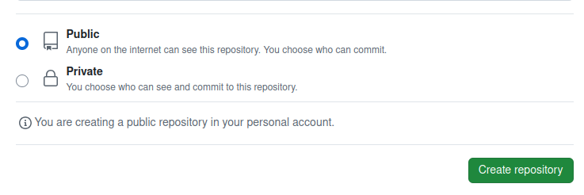

## Create a new repository in GitHub

Here, you'll copy our OpenSAFELY research template to your own GitHub
account, for developing your own study:

1. Click on the link below to create new repository based on our template.
   You may need to log in to GitHub if you are not already logged in:
    <a href="https://github.com/opensafely/research-template/generate" target="_blank">https://github.com/opensafely/research-template/generate</a>.
1. Use the **Owner** drop-down menu, and select the account you want to own the
   repository (typically under your own account)
1. Type a name for your repository, and an optional description
1. Choose a [repository visibility](../../../repositories.md#repository-visibility). This would usually be "Public"
   
1. There is an "Include all branches" option: this does **not** need to be selected.
   (You only need the main branch; the other branches are
   work-in-progress changes.)
1. Click **Create repository from template**
1. The new GitHub repository will take a moment to initialise, as it is running
   some setup in background. Wait about 1 minute, then reload the page, and you
   should see the README displayed now reflects the name you gave to the new
   repository.
1. Once created, select the "Settings" tab and scroll down to the option to the option to "Automatically delete head branches". This should be turned ON so that when you merge a branch it is automatically deleted, keeping your branches neat and tidy. Deleted branches can be restored if needed later.

   If you see `${GITHUB_REPOSITORY_NAME}` in your README, the repo is not yet initialised, wait a few seconds longer and reload.
