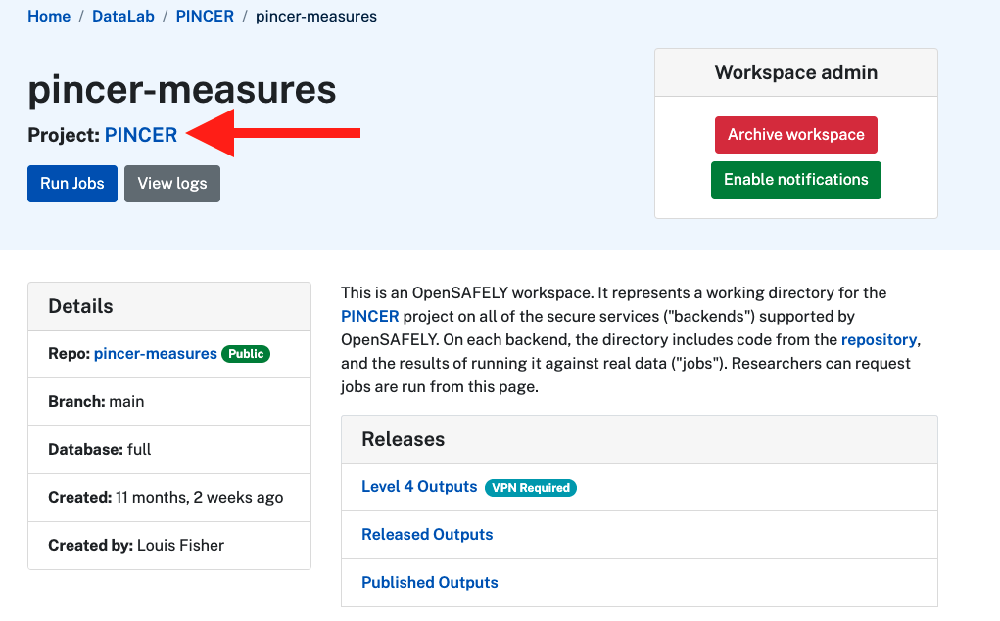
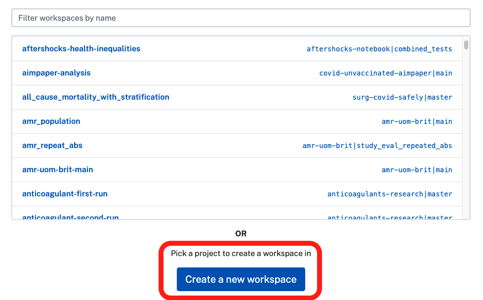
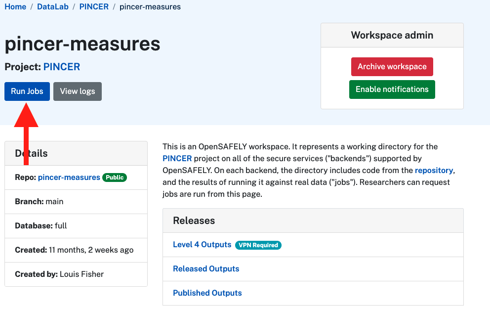
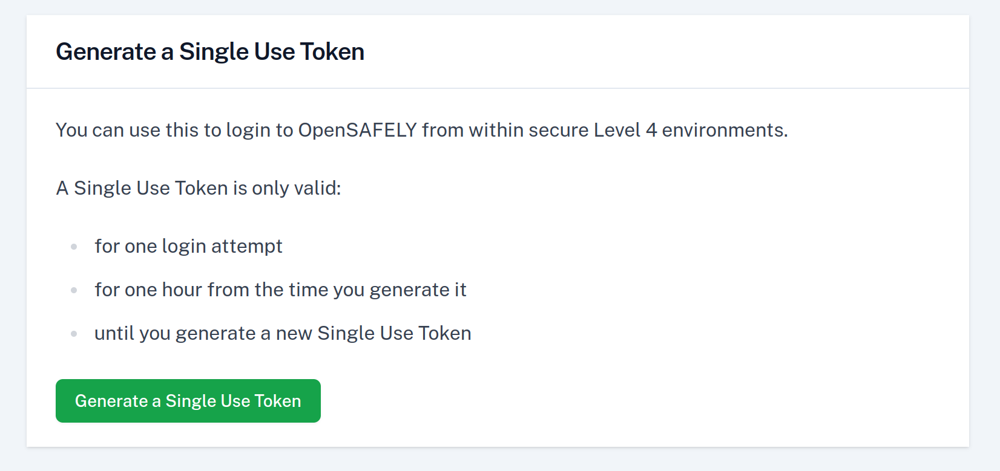
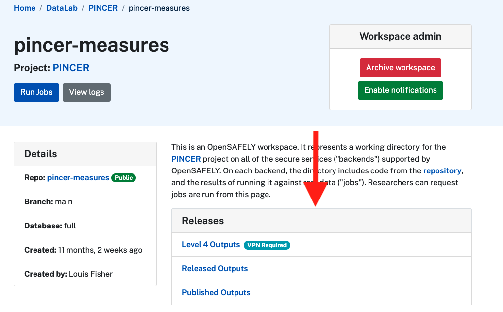
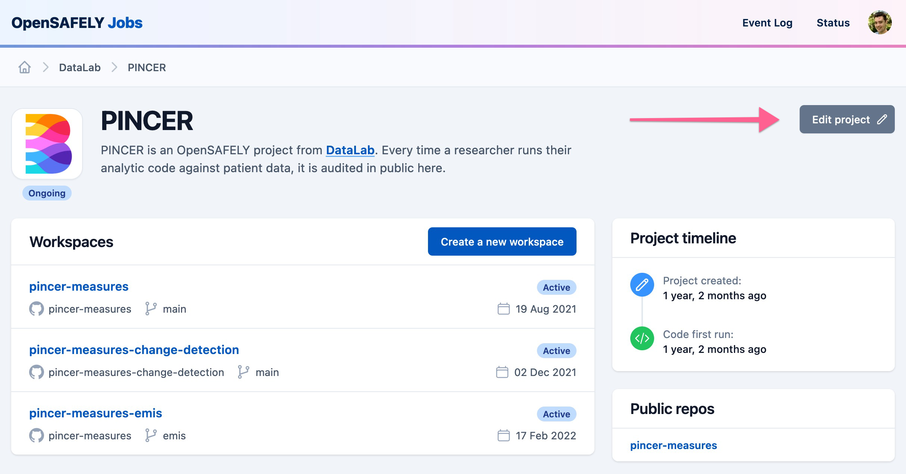
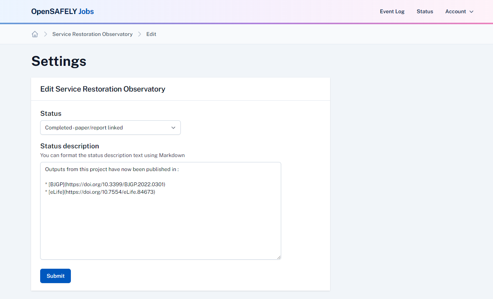

The [jobs site](https://jobs.opensafely.org/) is where you can run your code on the server against real data, view your analysis outputs on the server and view outputs that have been reviewed, approved and released from the server by our team of output checkers.

## Jobs site structure

The jobs site is centred around **Projects**. When an application to run a study in OpenSAFELY is [approved by the data controller](https://www.opensafely.org/onboarding-new-users/), a _Project_ is automatically created. You can see a list of approved projects, and the organisation they belong to [here](https://www.opensafely.org/approved-projects/). We will add any GitHub usernames listed in your approval to our `opensafely` [GitHub organisation](https://github.com/opensafely). We also will transfer your existing OpenSAFELY study repository (if you have one) into the same organisation. This allows OpenSAFELY to enforce certain security standards, such as [multi-factor authentication](https://docs.github.com/en/github/authenticating-to-github/securing-your-account-with-two-factor-authentication-2fa).

Within each _Project_, there are one or more **Workspaces**, which are linked to a GitHub repository in the [OpenSAFELY organisation](https://github.com/opensafely). Any [actions](https://docs.opensafely.org/actions-intro/) you develop as part of your [project pipeline](https://docs.opensafely.org/actions-pipelines/) within the attached repository are linked to the workspace, allowing these to be run against real data.

A _Job_ is an instance of an _Action_ running on real data. _Jobs_ are run by selecting one or more actions to be run as part of a single _Job Request_. You can see all the _Job Requests_ that have been run from a _Workspace_ by clicking on "View logs" from a _Workspace_ page. You can see a log of all _Job Requests_ being run [here](https://jobs.opensafely.org/event-log/).

```mermaid
graph TD
    A[Project] --> B[Workspace]
    A --> C[Workspace]
    B --> D[Job Request]
    B --> E[Job Request]
    C --> F[Job Request]
    subgraph Actions[Actions - taken from your project.yaml]
      Action_1[Action]
      Action_2[Action]
      Action_3[Action]
    end
    Action_1 --> F
    Action_2 --> F
    F --> G[Job]
    F --> H[Job]

```

### Output types

Once outputs have been produced by running _jobs_ from within a _Workspace_, there are several stages they must go through before being made publicly available:

1. **Outputs on the [Level 4 server](https://docs.opensafely.org/level-4-server/)**. These are outputs marked as `moderately_sensitive` in the `project.yaml` file and are only viewable when logged into the Level 4 server. These outputs have to be [reviewed by our output checking team](https://docs.opensafely.org/releasing-files/#3-how-are-files-reviewed) before they can leave the server.
2. **Released outputs**. These are analysis outputs that have been reviewed for any [disclosivity issues](https://docs.opensafely.org/releasing-files/#types-of-disclosure) and released from the Level 4 server by the output checking team to the relevant _Workspace_ on the Jobs site. These are only viewable if you have the correct permissions for the _Project_ the _Workspace_ belongs to.
3. **Draft public outputs**. Released outputs can only be shared with close collaborators of your projects (examples of who this could include can be found [here](https://www.opensafely.org/policies-for-researchers/#all-datasets-sharing)). To be shared more widely, they have to first be approved by NHS England. Once approved, and if you have the correct jobs site permissions, you can create draft public outputs for approval.
4. **Published outputs**. Once approved, draft public outputs are made publicly available to view by anyone through the _Workspace_ they belong to.

### Permissions

When users are approved to use the OpenSAFELY platform, each user is assigned roles that define what they are permitted to do on the jobs site within their project. By default, most researchers using the platform will have the `ProjectDeveloper` role for a specific _Project_, which permits them to:

* Create workspaces in that _Project_
* Run _jobs_ in _Project_ workspaces
* Cancel _jobs_ for this _Project_
* View job outputs for any _Workspace_ in this _Project_
* Create draft public outputs for approval

Users with the `ProjectCollaborator` role can:

* View released outputs
* View draft public outputs

There are some additional roles linked to the release of outputs from the server, reserved for output checkers:

`OutputChecker`:

* Release outputs from Level 4 environments
* Delete outputs in a release

`OutputPublisher`:

* Publish draft public outputs

#### Viewing and requesting changes to your permissions

You can view the permissions you have for your project by navigating to the _Project_ page (see arrow below), where can see the permissions for all researchers involved in your project.

If you are not able to do any of the tasks and you think you should, please contact your co-pilot to confirm you have the correct permissions.
## Creating a Workspace

* **Log in** using your GitHub credentials
* **Create a Workspace**:
    * Click the `Create a new workspace` button (circled in red below).
    * Pick a _Project_ from the list.
    * Click the `Create a new workspace` link.
    
    * Choose a name, for example the name of the repo.
    * Select the repo and branch whose action you want to run (in most cases, the branch will be either `main` or `master`).
    * Click `Create`.

When you add a new repository in the [opensafely organisation](https://github.com/opensafely), it may take up to 15 mintutes for it to be available to select at [https://jobs.opensafely.org](https://jobs.opensafely.org).
## Running your code on the server

* Click the `Run Jobs` button (see red arrow below) from your workspace.

*  **Select actions** to run:
    * Select the actions you want to run by clicking the `Run` buttons.
    * If any of these actions have dependent actions (e.g. running a cohort extractor action before an analysis script is run) then they will also be run, unless their outputs already exist.
      * If any dependencies have already been set to run, your current job will be queued until dependencies have completed.
    * Dependencies can be viewed by clicking the `Needs` button.
    * You can force dependencies to be run by clicking `Force run dependencies`, even if those actions have already been run.
    * You can choose to send notifications for the selected actions to your email address.
    * When you're ready, click `Submit`.

The workspace is available at `https://jobs.opensafely.org/<WORKSPACE_NAME>/`.
You can view the progress of these actions by click the `Logs` button from the workspace, or going to `https://jobs.opensafely.org/<WORKSPACE_NAME>/logs`. If you selected to receive notifications, you will also receive an email to notify you when each job completes.

When you submit a job-request you are competing with other users for resources on the server. As such, jobs can sometimes take a while to start even if their dependencies have successfully completed. You can see all the jobs currently running [here](https://jobs.opensafely.org/event-log/?backend=&status=running&username=&workspace=) and the current status of all OpenSAFELY backends [here](https://jobs.opensafely.org/status/).

Click here for information on the exact steps that occur when each job is run on the server

What happens:

1. A new, empty temporary directory for the job is created.
2. Copy in all files on the selected branch.
3. The job is run.
4. All the files matching the specified output patterns are copied into the local repo.
5. The log files for the job are saved into the `metadata/` directory.
6. The temporary directory is deleted.

Each job will either succeed or fail. In either case, the output and log files are only visible in the secure environment to avoid disclosure of potentially sensitive information.

## Viewing analysis outputs on the server

You can view `moderately_sensitive` outputs from any of your submitted _jobs_
via the Jobs website **if you have access to and are logged into the backend
the job was run on**.

However, whilst normally you log into [jobs.opensafely.org] from your machines
browser using Github, the secure server does not have access to
Github. So you need to use an alternate method to login, by generating a Single
Use Token, and then using it on the secure server to log in.

To generate a Single Use Token, before logging into the secure server, visit
[https://jobs.opensafely.org/settings/](https://jobs.opensafely.org/settings/),
and click on "Generate a Single Use Token". This will be 3 english words, which
you can memorize or write down. This token can be used to log in as you, but is
only valid for a short time, and only works once.

Once you are logged into the server via the VPN:

* Navigate to [https://jobs.opensafely.org/](https://jobs.opensafely.org/) using google chrome (make sure to use https://)
* Log in using your email or Github username, and the Single Use Token from the above step.
* You should be now logged in. This login will expire after two weeks of not being used.

Once logged in, to view your `moderately_sensitive` outputs:

* Navigate to your _Workspace_
* Under _Releases_, navigate to Level 4 Outputs
* Choose the correct backend
* Pick the file you would like to view from the list of files (you can search)

## Viewing released outputs

You can view the various [output types](#output-types) from the `Releases` section (see red arrow below) of your workspace.

Any files that you would like to be released from the server, have to first be checked by our team of output checkers. You can find instructions for requesting a release [here](https://docs.opensafely.org/releasing-files/#2-requesting-release-of-outputs-from-the-server).

Once reviewed, approved and released, your requested files will be available to view from your _Workspace_ in the _Released Outputs_ section of Releases. To view released outputs, you need to have the **ProjectDeveloper** or **ProjectCollaborator** role. If you would like to add a project collaborator to your _Workspace_, please read [this section](https://www.opensafely.org/policies-for-researchers/#all-datasets-sharing) of the researcher policy and/or contact your co-pilot (if you have one).

## Publishing outputs

You must seek NHS England approval for any publication or wider sharing of results, papers, presentations (e.g. submitting to a journal or a pre-print server, or uploading to any public facing website).

For instructions on how to request approval, please see [this section](https://www.opensafely.org/policies-for-researchers/#all-datasets-publication) of the researcher policy document. Following approval from NHSE, you should also create draft public outputs for review. To do this, navigate to 'All outputs' which contains your latest outputs from within the "Released outputs" section of your workspace and click the `Publish` button. It is currently only possible to publish the latest version of all of these files.

As part of publishing your outputs, you should also make the repository where your analysis code is written public. You can find instructions on how to do that [here](https://docs.opensafely.org/publishing-repo/).

Once approved, your released outputs will be “published” and viewable from the published outputs in the `Published outputs` section of your `Releases`. This is accessible by everyone, even those without a login.

## Updating project status
When you start a new project on OpenSAFELY it will have the _Ongoing_ status, but as your work progresses you'll want to update this status.

If you are a member of a project you will see an `Edit` button near the top of your project page:

Select your project status using the options in the dropdown box.

Further details should be provided in the `Status description` field. Guidance for each status type is provided below.

* `Postponed`: provide the reasons why the project has been postponed. You must also contact [our IG team](mailto:applications@opensafely.org) to let them know.
* `Retired`: provide the reasons why the project has been retired and provide a brief report summarising any results. You must also contact [our IG team](mailto:applications@opensafely.org) to let them know.
* `Ongoing - paper/report linked`: provide URLs to published papers or reports (this includes preprints). If further papers/reports are expected, please give details.
* `Completed - paper/reports linked`: provide URLs to published papers or reports (this includes preprints). If further papers/reports are expected, please give details.
* `Completed - awaiting paper/reports`: provide some indication of when papers and/or reports are expected to be published.

