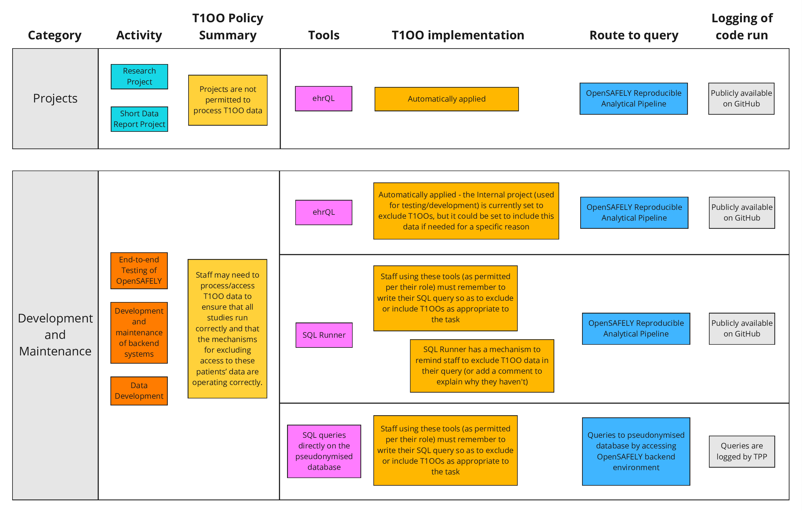

## Background

The OpenSAFELY platform was established during the COVID-19 pandemic; the legal basis the platform originally operated under was for the monitoring and control of communicable disease and other risks to public health.
NHS England policy was that the [Type 1 Opt-Out](https://www.nhs.uk/using-the-nhs/about-the-nhs/opt-out-of-sharing-your-health-records/) was not required to be upheld due to the overriding public interest in responding to the COVID-19 pandemic.
In June 2023, the [legal basis for the operation of the platform](https://digital.nhs.uk/about-nhs-digital/corporate-information-and-documents/directions-and-data-provision-notices/data-provision-notices-dpns/opensafely-covid-19-service-data-provision-notice) changed to powers that traditionally _do_ uphold a Type 1 Opt-out.
Therefore, since June 2023, the OpenSAFELY platform has been required to exclude patients with a Type 1 Opt-out from _new_ projects.

## Technical details

### How is permission to access Type 1 Opt-Out data determined?

The list of projects with continuing type 1 opt-out access has been embedded into the platform's public codebase, rather than being stored in a database.
This is an unusual step from an engineering standpoint, but it means that any changes to the list are automatically included in the public audit log of code changes.
It is also automatically covered by our [code protection rules](https://docs.github.com/en/repositories/configuring-branches-and-merges-in-your-repository/managing-protected-branches/about-protected-branches#require-pull-request-reviews-before-merging) which require independent sign-off by another developer for all code changes.

We have also added an additional code protection rule that changes to the specific files involved require sign-off from the Information Governance team (the [code owners](https://docs.github.com/en/repositories/managing-your-repositorys-settings-and-features/customizing-your-repository/about-code-owners)).

The [project permissions](https://github.com/opensafely-core/job-server/blob/main/jobserver/permissions/t1oo.py) file, the [history of changes](https://github.com/opensafely-core/job-server/commits/main/jobserver/permissions/t1oo.py) to it, and the additional [code protection rules](https://github.com/opensafely-core/job-server/blob/main/.github/CODEOWNERS) are all publicly available on Github.

### How is permission to access Type 1 Opt-Out data enforced?

In OpenSAFELY researchers do not have direct access to the data.
Instead they describe the data they require using [ehrQL](https://docs.opensafely.org/ehrql/), our Electronic Health Record Query Language, and ehrQL is responsible for fetching it.

At the point where ehrQL needs to fetch the data, it is told (by the system described above) whether it should include data from opted-out patients or not.

Every ehrQL query contains a "population definition" which specifies exactly which criteria a patient must meet to be included in the result e.g. "patients between the ages of 18 and 65 who have not recently changed GP practice".
Unless a project is named in the project permissions file, ehrQL will automatically add an extra condition to this population definition: the patient's pseudonymous ID number must not appear in the list of ID numbers with a registered type 1 opt-out.

This list is provided by the system suppliers and stored in the secure database along with the rest of the patient data.
It consists of a single bespoke type 1 opt-out table, with a single list of pseudonymous IDs and no other information.

Again, the [code which enforces this](https://github.com/opensafely-core/ehrql/blob/8494b943be0d73d02413ad41272a612a5fddbff3/ehrql/backends/tpp.py#L75-L100) is publicly available on Github.

### Data access which does _not_ go via ehrQL

There are three sorts of circumstances under which data access in OpenSAFELY does not go via ehrQL, each with different behaviour with respect to type 1 opted-out patients' data.

#### 1. Cohort Extractor

ehrQL's predecessor was a tool called "Cohort Extractor" and studies which began before the launch of ehrQL continue to use this tool; these all had permission to process data from patients with a type 1 opt-out.
Cohort Extractor applies exactly the [same rules](https://github.com/opensafely-core/cohort-extractor/blob/18c954499ec0a8fbcf5f83e0a4d1bbe2a469b0c1/cohortextractor/tpp_backend.py#L417-L435) as does ehrQL with respect to opt-outs.
However, as a tool, it was not originally intended to enforce data access controls and its design makes it difficult to implement the same security boundaries as ehrQL.
As a result, we have limited access to Cohort Extractor to just those projects which _already_ have access to opted-out data.
This is enforced by the same mechanism as access to opted-out data i.e. an auditable file of [permitted projects](https://github.com/opensafely-core/job-server/blob/main/jobserver/permissions/cohortextractor.py), and enforced [code protection rules](https://github.com/opensafely-core/job-server/blob/main/.github/CODEOWNERS).

We may make limited exceptions to this in the short term if there are specific reasons why a project cannot feasibly use ehrQL and where we can be confident there is no attempt to subvert Cohort Extractor's security.
Any such exceptions will appear, along with details of who approved them and why, in the public [audit log](https://github.com/opensafely-core/job-server/commits/main/jobserver/permissions/cohortextractor.py).

Longer term, Cohort Extractor will be retired entirely.

#### 2. SQL Runner

SQL Runner is a tool which allows the user to retrieve data by writing "raw" SQL rather than ehrQL.
It is intended for the data curation and investigation tasks necessary for operating the platform, rather than research purposes.
Its use is therefore limited to just those OpenSAFELY staff involved in this work.
Details of the circumstances under which OpenSAFELY staff may perform development and maintenance activities are described in our [Data Access Policy](https://docs.opensafely.org/developer-access-policy/).

This is enforced by a parallel mechanism to that which controls use of Cohort Extractor and any changes to this policy will appear in the public [audit log](https://github.com/opensafely-core/job-server/commits/main/jobserver/permissions/sqlrunner.py).

SQL Runner does not itself grant or deny access to opted-out data.
Instead the user must declare whether the task in question should properly exclude such data or not, and SQL Runner enforces that such a declaration has been made by rejecting any queries which do not explicitly reference the opt-out table.

All SQL Runner code run against patient data is also visible on our public “jobs” server: [https://jobs.opensafely.org/](https://jobs.opensafely.org/); therefore, it will be possible to see which code (or jobs) were run against patients with a type 1 opt-out.

#### 3. Direct access to pseudonymised data

In order to facilitate the operation and maintenance of the OpenSAFELY platform a small number of individuals are able to access the pseudonymised data directly, without going via ehrQL, Cohort Extractor or SQL Runner.
It is important to note that the code run in such circumstances will not be publicly visible on our “jobs” server, but it is logged in the database audit file of the GP system suppliers; preventing access to patient data with a type 1 opt-out is not enforceable at this level.

The circumstances under which this is permitted and the rationale are covered in detail in our [Data Access Policy](https://docs.opensafely.org/developer-access-policy/) but, importantly, such access is never used for research purposes.

## Summary Diagram

